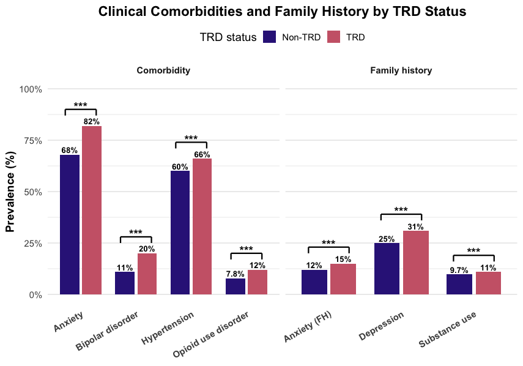

# Clinical Characteristics of Antidepressant Treatment Escalation in Major Depressive Disorder

HGEN 603 final class project by Sina Mahdiani, Spring 2026.

This project uses electronic health record and survey data from the National Institutes of Health All of Us Research Program to examine clinical characteristics associated with antidepressant treatment escalation among people with major depressive disorder (MDD). Treatment-resistant depression (TRD) is represented by a pragmatic EHR-based proxy that combines antidepressant switching, augmentation therapy, and ketamine or esketamine exposure.

> This repository documents a course project. It is not a peer-reviewed publication, a validated clinical prediction tool, or medical advice.

## Project overview

The analysis compares participants meeting the treatment-escalation proxy with participants who did not meet the proxy across:

- demographic characteristics;
- psychiatric and medical comorbidities;
- self-reported family history;
- clinical measurements;
- healthcare utilization and medication burden; and
- a multivariable logistic regression model with ROC analysis.

The analytic cohort included 78,251 participants with MDD. In the course-project analysis, 44,360 participants met the treatment-escalation proxy and 33,891 did not. Healthcare utilization and psychiatric comorbidity showed stronger associations with the proxy outcome than most individual clinical measurements. The adjusted model had an AUC of 0.766.



## Repository contents

```text
analysis/      R scripts transcribed and cleaned from the original Word document
docs/          workflow, phenotype, data-access, and privacy documentation
figures/       final aggregate figures
presentation/  public-safe presentation PDF
reports/       proposal, public-safe final report, and supplementary materials
```

The presentation video is attached to the repository's [latest release](https://github.com/SinaMhdn95/HGEN603-TRD-All-of-Us-Analysis/releases/latest) because video files are not suitable for normal Git version control.

## Running the analysis

The code must run inside an authorized All of Us Researcher Workbench workspace with access to the Controlled Tier Dataset v8. No All of Us participant-level data are included in this repository.

1. Add this repository to an authorized Researcher Workbench workspace.
2. Open an R notebook or terminal at the repository root.
3. Review the cohort and concept definitions before querying data.
4. Run the scripts in numerical order, or use:

```r
source("analysis/00_run_all.R")
```

The extraction scripts query BigQuery and write temporary exports to the workspace bucket. Running the complete workflow may take substantial time and cloud resources.

## Reproducibility notes

- Data source: All of Us Research Program Controlled Tier Dataset v8.
- Data model: OMOP Common Data Model.
- Primary language: R 4.5.0.
- Main packages: `tidyverse`, `bigrquery`, `lubridate`, `gtsummary`, `gt`, `broom`, `car`, `pROC`, `naniar`, `patchwork`, and `scales`.
- Individual-level data and generated RDS files remain inside the Researcher Workbench and are excluded by `.gitignore`.

See [Data access and privacy](docs/DATA_ACCESS_AND_PRIVACY.md) and [Analysis workflow](docs/ANALYSIS_WORKFLOW.md) before running or adapting the project.

## Acknowledgment

We gratefully acknowledge All of Us participants for their contributions, without whom this research would not have been possible. We also thank the National Institutes of Health's All of Us Research Program for making available the participant data examined in this course project.

This study used data from the All of Us Research Program's Controlled Tier Dataset v8, available to authorized users through the Researcher Workbench.

## License

The analysis code is available under the [MIT License](LICENSE). Reports, figures, presentation materials, and All of Us-derived results remain subject to the notices in [NOTICE.md](NOTICE.md) and applicable All of Us policies.
